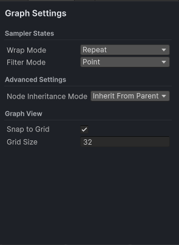

# Graph Settings
Most of the time you will not change these, but they are documented here

## Sampler States
- Wrap Mode: This defines how nodes will wrap when they extend past their boundaries, options are: Repeat (default), Clamp, Mirror and Mirror once.
- Filter Mode: This defines how the nodes will filter, options are Point, Bilinear and Trilinear.

## Advanced Settings
 Node Inheritance Mode: Nodes can and do have settings, this defines how the settings flow through the graph.  The options are:
 - Inherit From Parent: Nodes get their settings from their parent.  *Default*
 - Inherit From Graph: All nodes use the graph settings
 - Inherit From Child: This is the reverse of inherit from parent, in that the child pushes the settings up to the parent

 ## Graph View
 Here you can set snap to grid and grid size options. 
 - Snap To Grid: Nodes will snap to the grid size defined.  *Default On*
 - Grid Size: In pixels, this defines the size of the snap grid.  *Default 32*