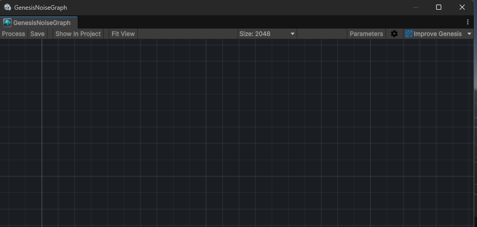
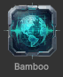
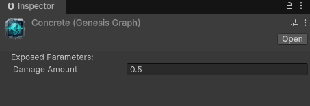

# Graphs
Graphs are worksheets that contain nodes and node connectors.  Think of them as the sheet a flowchart is on.

## Create a graph
A Genesis Noise Graph can be created in one of two ways:
- In the Unity project browser:  Right click in a folder and select Genesis Noise->Noise Graph
- In Assets->Genesis Noise->Noise Graph (This will create a noise graph in whatever folder you currently have open)

## Opening a graph
Opening a graph is as simple as double clicking on an already defined graph:

# Graph Window
At the top of the graph window is a tool bar with settings and commands for Genesis Noise:

## Process
This will run all of the nodes in the graph, creating whatever it is the graph is designed to create.

## Save
This saves the current iteration of the graph back to the original file

## Fit View
This resizes the view to fit the currently loaded graph.  Useful if you accidentally scrolled to a blank area.

## Size
A drop down that defines the size of the textures that will be generated by this Graph.

## Parameters
The Parameters for the graph.  Parameters are explained here: [Parameters](Documentation/Parameters/index.md)

## Graph Settings (Gear Icon)
The settings for the graph and graph editor.  Described in: [Graph Settings](Settings.md)

## Improve Genesis 
Links to documentation, opening a bug report and feature requests.

# Graph Inspector

The graph inspector will show an editor for all of the exposed parameters of the graph.  For more information: [Parameters](Documentation/Parameters/index.md)