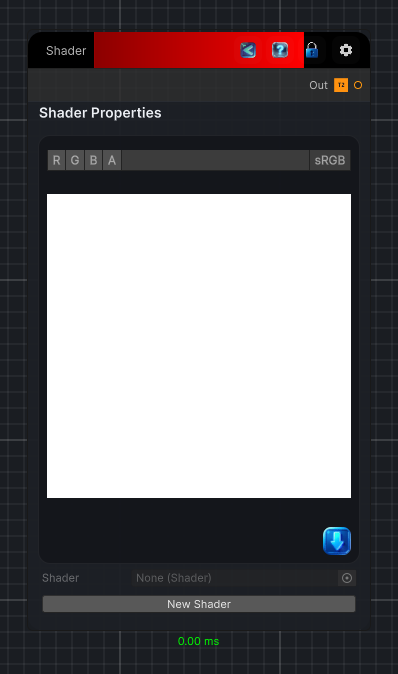

<link rel="stylesheet" href="../_assets/theme.css">

<button type="button" class="genesis-theme-toggle" data-genesis-theme-toggle aria-label="Toggle theme">Dark</button>

---
category: "Base Nodes"
---

# Shader

> ShaderNode is the base class for all shader nodes in the Genesis Noise system.  This node will automatically show the shader properties as

## Description

        ShaderNode is the base class for all shader nodes in the Genesis Noise system.  This node will automatically show the shader properties as
        inputs that you can connect to other nodes.  It is used to create custom shader nodes that can be used in the noise generation process.

## Inputs

| Name | Type | Description |
|------|------|-------------|

## Outputs

| Name | Type |
|------|------|
| Out | Texture2D |

## Parameters

| Setting | Type | Default | Description |
|---------|------|---------|-------------|
| nodeVariables | VariableStorage | AhahGames.GenesisNoise.Graph.VariableStorage | |
| GUID | String | a6483814-ffd1-4d1f-9cca-ae4c05fd6005 | |
| expanded | Boolean | False | |

## See Also

- [Back to Shader](./base-nodes-index.md)
