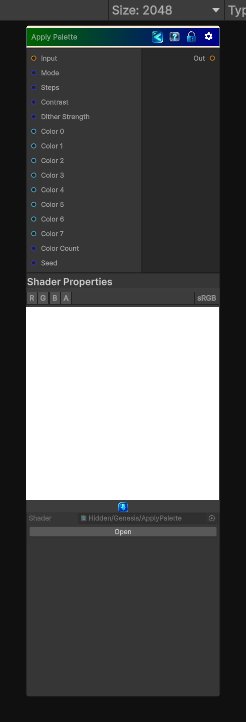

<link rel="stylesheet" href="../_assets/theme.css">

<button type="button" class="genesis-theme-toggle" data-genesis-theme-toggle aria-label="Toggle theme">Dark</button>

---
category: "Color"
---

# Apply Palette

> - Input grayscale → remap to a color palette

## Description

- Input grayscale → remap to a color palette
- Supports 2–8 colors
- Supports stepped or smooth interpolation
- Supports palette indexing
- Fully deterministic
- CRT‑safe
- Artist‑friendly

## Inputs

| Name | Type | Description |
|------|------|-------------|

## Outputs

| Name | Type |
|------|------|

## Parameters

| Setting | Type | Default | Description |
|---------|------|---------|-------------|
| Mode | Enum | 0 | Controls the mode. |
| Steps | Range | 4 | Controls the steps. |
| Contrast | Range | 1.0 | Controls the contrast. |
| Dither Strength | Range | 0.0 | Controls the dither strength. |
| Color 0 | Color | (0,0,0,1) | Controls the color 0. |
| Color 1 | Color | (1,1,1,1) | Controls the color 1. |
| Color 2 | Color | (1,0,0,1) | Controls the color 2. |
| Color 3 | Color | (0,1,0,1) | Controls the color 3. |
| Color 4 | Color | (0,0,1,1) | Controls the color 4. |
| Color 5 | Color | (1,1,0,1) | Controls the color 5. |
| Color 6 | Color | (1,0,1,1) | Controls the color 6. |
| Color 7 | Color | (0,1,1,1) | Controls the color 7. |
| Color Count | Range | 2 | Controls the color count. |
| Seed | Float | 1 | Controls the seed. |

## See Also

- [Back to Apply Palette](./color-index.md)
