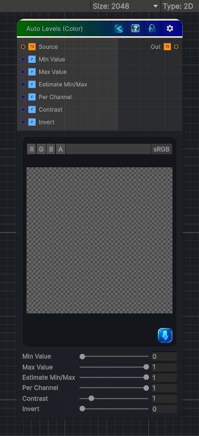

<link rel="stylesheet" href="../_assets/theme.css">

<button type="button" class="genesis-theme-toggle" data-genesis-theme-toggle aria-label="Toggle theme">Dark</button>

---
category: "Color"
---

# Auto Levels (Color)

> Automatically remaps color levels.

## Description

Automatically remaps color levels.

By default each RGB channel is stretched independently so local darkest values map to 0 and brightest to 1.
You can disable per-channel mode to use a single luminance range for all channels.

## Inputs

| Name | Type | Description |
|------|------|-------------|
| Source | Texture2D | Input source |
| Min Value | Single | Manual minimum when auto estimate is disabled |
| Max Value | Single | Manual maximum when auto estimate is disabled |
| Estimate Min/Max | Single | Auto estimate min and max from a 3x3 neighborhood |
| Per Channel | Single | When enabled, levels are estimated and remapped per RGB channel |
| Contrast | Single | Contrast shaping |
| Invert | Single | 1 will invert the result |

## Outputs

| Name | Type |
|------|------|
| Out | Texture2D |

## Parameters

| Setting | Type | Default | Description |
|---------|------|---------|-------------|
| Source | 2D | white | Input source |
| Min Value | Range | 0.0 | Manual minimum when auto estimate is disabled |
| Max Value | Range | 1.0 | Manual maximum when auto estimate is disabled |
| Estimate Min/Max | Range | 1.0 | Auto estimate min and max from a 3x3 neighborhood |
| Per Channel | Range | 1.0 | When enabled, levels are estimated and remapped per RGB channel |
| Contrast | Range | 1.0 | Contrast shaping |
| Invert | Range | 0.0 | 1 will invert the result |

## See Also

- [Back to Auto Levels (Color)](./color-index.md)
