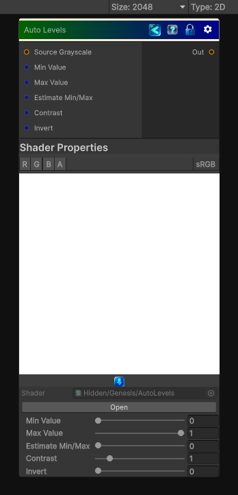

<link rel="stylesheet" href="../_assets/theme.css">

<button type="button" class="genesis-theme-toggle" data-genesis-theme-toggle aria-label="Toggle theme">Dark</button>

---
category: "Color"
---

# Auto Levels

> Per texture min/max remap, stretching the histogram so the darkest pixel is 0 and the brightest is 1

## Description

Per texture min/max remap, stretching the histogram so the darkest pixel is 0 and the brightest is 1

## Inputs

| Name | Type | Description |
|------|------|-------------|

## Outputs

| Name | Type |
|------|------|

## Parameters

| Setting | Type | Default | Description |
|---------|------|---------|-------------|
| Source Grayscale | 2D | white | Input source |
| Min Value | Range | 0.0 | The lowest level, below this level the pixels will return black |
| Max Value | Range | 1.0 | The upper level, above this level the pixels will return black |
| Estimate Min/Max | Range | 0.0 | Auto estimate min and max with a cheap 9 sample probe |
| Contrast | Range | 1.0 | Higher levels will push increase the contrast |
| Invert | Range | 0.0 | 1 will invert the results |

## See Also

- [Back to Auto Levels](./color-index.md)
