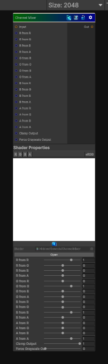

<link rel="stylesheet" href="../_assets/theme.css">

<button type="button" class="genesis-theme-toggle" data-genesis-theme-toggle aria-label="Toggle theme">Dark</button>

---
category: "Color"
---

# Channel Mixer

> - Supports RGB or RGBA input

## Description

- Supports RGB or RGBA input
- Per‑channel mixing (R from RGB, G from RGB, B from RGB, A from RGBA)
- Optional clamping
- Optional grayscale output
- Fully deterministic
- CRT‑safe
- Artist‑friendly

## Inputs

| Name | Type | Description |
|------|------|-------------|

## Outputs

| Name | Type |
|------|------|

## Parameters

| Setting | Type | Default | Description |
|---------|------|---------|-------------|
| Clamp Output | Range | 1 | Controls the clamp output. |
| Force Grayscale Output | Range | 0 | Controls the force grayscale output. |

## See Also

- [Back to Channel Mixer](./color-index.md)
