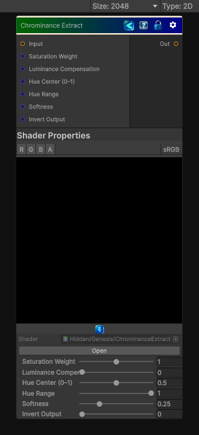

<link rel="stylesheet" href="../_assets/theme.css">

<button type="button" class="genesis-theme-toggle" data-genesis-theme-toggle aria-label="Toggle theme">Dark</button>

---
category: "Color"
---

# Chrominance Extract

> - Extracts chroma (colorfulness) from RGB

## Description

- Extracts chroma (colorfulness) from RGB
- Supports multiple chroma models
- Optional hue isolation
- Optional saturation weighting
- Optional luminance compensation
- Fully deterministic
- CRT‑safe
- Artist‑friendly

## Inputs

| Name | Type | Description |
|------|------|-------------|

## Outputs

| Name | Type |
|------|------|

## Parameters

| Setting | Type | Default | Description |
|---------|------|---------|-------------|
| Saturation Weight | Range | 1.0 | Controls the saturation weight. |
| Luminance Compensation | Range | 0.0 | Controls the luminance compensation. |
| Hue Center (0–1) | Range | 0.5 | Controls the hue center (0–1). |
| Hue Range | Range | 1.0 | Controls the hue range. |
| Softness | Range | 0.25 | Controls the softness. |
| Invert Output | Range | 0 | Controls the invert output. |

## See Also

- [Back to Chrominance Extract](./color-index.md)
