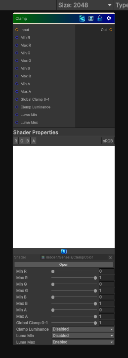

<link rel="stylesheet" href="../_assets/theme.css">

<button type="button" class="genesis-theme-toggle" data-genesis-theme-toggle aria-label="Toggle theme">Dark</button>

---
category: "Color"
---

# Clamp

> - Clamp each channel independently

## Description

- Clamp each channel independently
- Optional min/max per channel
- Optional global clamp (0–1)
- Fully CRT‑safe
- Deterministic
- Artist‑friendly

## Inputs

| Name | Type | Description |
|------|------|-------------|

## Outputs

| Name | Type |
|------|------|

## Parameters

| Setting | Type | Default | Description |
|---------|------|---------|-------------|
| Min R | Range | 0 | Controls the min r. |
| Max R | Range | 1 | Controls the max r. |
| Min G | Range | 0 | Controls the min g. |
| Max G | Range | 1 | Controls the max g. |
| Min B | Range | 0 | Controls the min b. |
| Max B | Range | 1 | Controls the max b. |
| Min A | Range | 0 | Controls the min a. |
| Max A | Range | 1 | Controls the max a. |
| Global Clamp 0–1 | Range | 1 | Controls the global clamp 0–1. |
| Clamp Luminance | Enum | 0 | Controls the clamp luminance. |
| Luma Min | Enum | 0 | Controls the luma min. |
| Luma Max | Enum | 1 | Controls the luma max. |

## See Also

- [Back to Clamp](./color-index.md)
