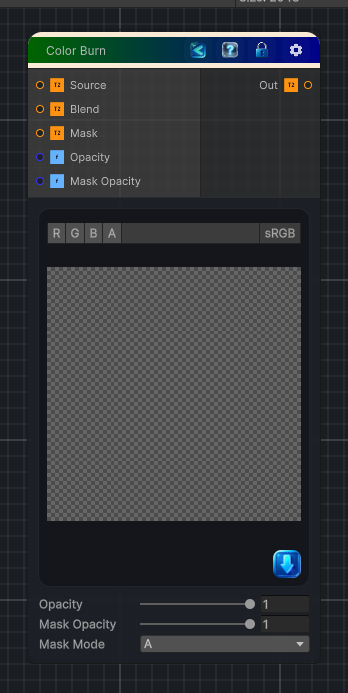

<link rel="stylesheet" href="../_assets/theme.css">

<button type="button" class="genesis-theme-toggle" data-genesis-theme-toggle aria-label="Toggle theme">Dark</button>

---
category: "Color"
---

# Color Burn

> Applies a Substance-style color burn blend between a source texture and a blend texture.

## Description

Applies a Substance-style color burn blend between a source texture and a blend texture.

An optional mask can control where the burn is applied.

## Inputs

| Name | Type | Description |
|------|------|-------------|
| Source | Texture2D |  |
| Blend | Texture2D |  |
| Mask | Texture2D |  |
| Opacity | Single | Opacity of the color burn effect |
| Mask Opacity | Single | How strongly the mask affects burn opacity. 0 ignores the mask, 1 uses the mask fully. |

## Outputs

| Name | Type |
|------|------|
| Out | Texture2D |

## Parameters

| Setting | Type | Default | Description |
|---------|------|---------|-------------|
| Opacity | Range | 1 | Opacity of the color burn effect |
| Mask Opacity | Range | 1 | How strongly the mask affects burn opacity. 0 ignores the mask, 1 uses the mask fully. |
| Mask Mode | Enum | 4 | Select which channel is used to sample the mask value |

## See Also

- [Back to Color Burn](./color-index.md)
