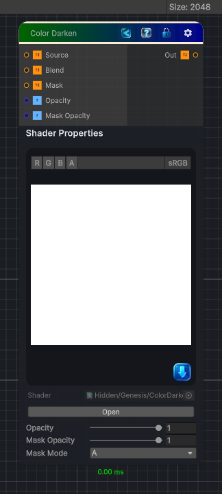

<link rel="stylesheet" href="../_assets/theme.css">

<button type="button" class="genesis-theme-toggle" data-genesis-theme-toggle aria-label="Toggle theme">Dark</button>

---
category: "Color"
---

# Color Darken

> Applies a Darken blend between a source texture and a blend texture.

## Description

Applies a Darken blend between a source texture and a blend texture.

For each RGB channel, the darker value from Source or Blend is retained. Opacity and an optional mask control the strength of the effect.

## Inputs

| Name | Type | Description |
|------|------|-------------|
| Source | Texture2D |  |
| Blend | Texture2D |  |
| Mask | Texture2D |  |
| Opacity | Single |  |
| Mask Opacity | Single |  |

## Outputs

| Name | Type |
|------|------|
| Out | Texture2D |

## Parameters

| Setting | Type | Default | Description |
|---------|------|---------|-------------|
| Opacity | Range | 1 | Controls the opacity. |
| Mask Opacity | Range | 1 | Controls the mask opacity. |
| Mask Mode | Enum | 4 | Controls the mask mode. |

## See Also

- [Back to Color Darken](./color-index.md)
