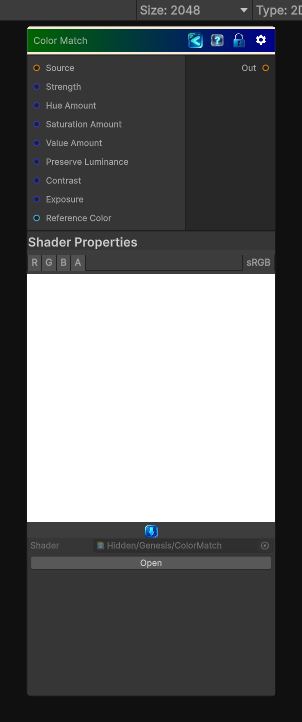

<link rel="stylesheet" href="../_assets/theme.css">

<button type="button" class="genesis-theme-toggle" data-genesis-theme-toggle aria-label="Toggle theme">Dark</button>

---
category: "Color"
---

# Color Match

> Matches the color character of a source texture to a reference color, with independent hue, saturation, and value transfer controls.

## Description

Matches the color character of a source texture to a reference color, with independent hue, saturation, and value transfer controls.

## Inputs

| Name | Type | Description |
|------|------|-------------|

## Outputs

| Name | Type |
|------|------|

## Parameters

| Setting | Type | Default | Description |
|---------|------|---------|-------------|
| Reference Color | Color | (1, 1, 1, 1) | Controls the reference color. |
| Strength | Range | 1.0 | Overall color match strength |
| Hue Amount | Range | 1.0 | How strongly reference hue replaces source hue |
| Saturation Amount | Range | 1.0 | How strongly reference saturation replaces source saturation |
| Value Amount | Range | 0.0 | How strongly reference value replaces source value |
| Preserve Luminance | Range | 0.5 | Preserve source luminance after matching |
| Contrast | Range | 1.0 | Final contrast applied around mid gray |
| Exposure | Range | 0.0 | Final exposure offset |

## See Also

- [Back to Color Match](./color-index.md)
