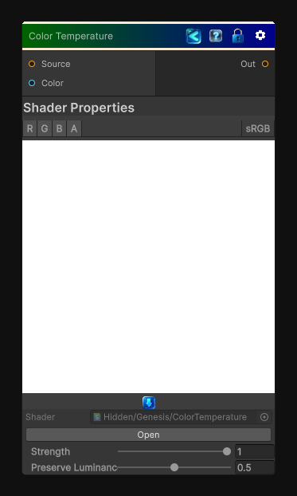

<link rel="stylesheet" href="../_assets/theme.css">

<button type="button" class="genesis-theme-toggle" data-genesis-theme-toggle aria-label="Toggle theme">Dark</button>

---
category: "Color"
---

# Color Temperature

> Applies a color temperature/tint color to an input texture, with strength and luminance preservation controls.

## Description

Applies a color temperature/tint color to an input texture, with strength and luminance preservation controls.

## Inputs

| Name | Type | Description |
|------|------|-------------|

## Outputs

| Name | Type |
|------|------|

## Parameters

| Setting | Type | Default | Description |
|---------|------|---------|-------------|
| Color | Color | (1, 1, 1, 1) | Controls the color. |
| Strength | Range | 1 | Blend amount for the color temperature adjustment. |
| Preserve Luminance | Range | 0.5 | Preserve original luminance after applying the color adjustment. |

## See Also

- [Back to Color Temperature](./color-index.md)
