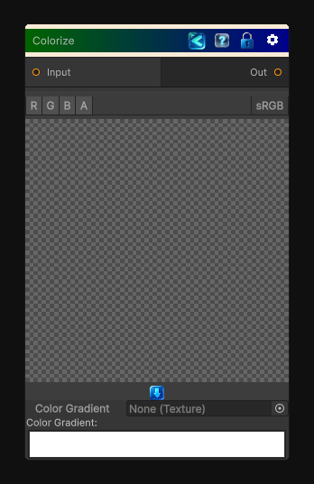

<link rel="stylesheet" href="../_assets/theme.css">

<button type="button" class="genesis-theme-toggle" data-genesis-theme-toggle aria-label="Toggle theme">Dark</button>

---
category: "Color"
---

# Colorize

> Converts a grayscale image to a colorized image based on a gradient

## Description

Converts a grayscale image to a colorized image based on a gradient

## Inputs

| Name | Type | Description |
|------|------|-------------|

## Outputs

| Name | Type |
|------|------|

## Parameters

| Setting | Type | Default | Description |
|---------|------|---------|-------------|
| Color Gradient | 2D | white | Controls the color gradient. |

## See Also

- [Back to Colorize](./color-index.md)
