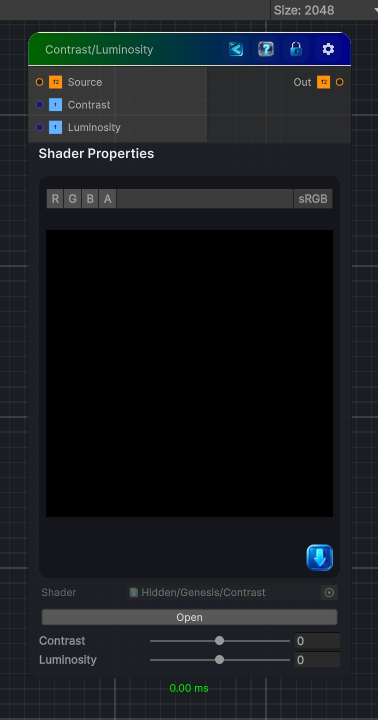

<link rel="stylesheet" href="../_assets/theme.css">

<button type="button" class="genesis-theme-toggle" data-genesis-theme-toggle aria-label="Toggle theme">Dark</button>

---
category: "Color"
---

# Contrast & Luminosity

> Adjusts the contrast and luminosity of the source color.

## Description

Adjusts the contrast and luminosity of the source color.

## Inputs

| Name | Type | Description |
|------|------|-------------|
| Source | Texture2D |  |
| Contrast | Single | Adjusts the contrast of the image |
| Luminosity | Single | Adjusts the luminosity or brightness of the image |

## Outputs

| Name | Type |
|------|------|
| Out | Texture2D |

## Parameters

| Setting | Type | Default | Description |
|---------|------|---------|-------------|
| Contrast | Range | 0 | Adjusts the contrast of the image |
| Luminosity | Range | 0 | Adjusts the luminosity or brightness of the image |

## See Also

- [Back to Contrast & Luminosity](./color-index.md)
