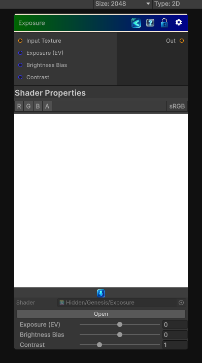

<link rel="stylesheet" href="../_assets/theme.css">

<button type="button" class="genesis-theme-toggle" data-genesis-theme-toggle aria-label="Toggle theme">Dark</button>

---
category: "Color"
---

# Exposure

> - Takes any input texture

## Description

- Takes any input texture
- Applies exposure compensation (photographic EV)
- Uses the correct formula:
\mathrm{color_{\mathnormal{out}}}=\mathrm{color_{\mathnormal{in}}}\cdot 2^{\mathrm{exposure}}- Includes contrast and bias shaping for artistic control

## Inputs

| Name | Type | Description |
|------|------|-------------|

## Outputs

| Name | Type |
|------|------|

## Parameters

| Setting | Type | Default | Description |
|---------|------|---------|-------------|
| Input Texture | 2D | white | Controls the input texture. |
| Exposure (EV) | Range | 0.0 | Controls the exposure (ev). |
| Brightness Bias | Range | 0.0 | Controls the brightness bias. |
| Contrast | Range | 1.0 | Controls the contrast. |

## See Also

- [Back to Exposure](./color-index.md)
