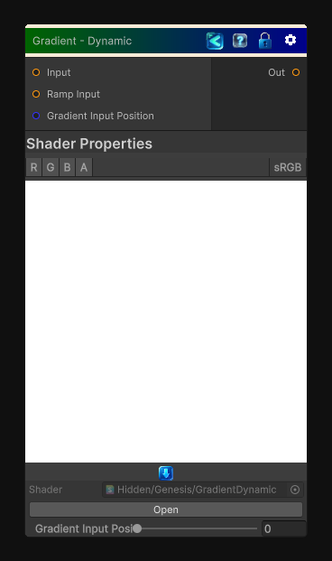

<link rel="stylesheet" href="../_assets/theme.css">

<button type="button" class="genesis-theme-toggle" data-genesis-theme-toggle aria-label="Toggle theme">Dark</button>

---
category: "Color"
---

# Gradient - Dynamic

> Maps an input through an externally supplied gradient ramp, similar to Substance Designer's Gradient (Dynamic).

## Description

Maps an input through an externally supplied gradient ramp, similar to Substance Designer's Gradient (Dynamic).

Use this when you want:
- Gradient colors to come from another node or exposed texture input
- Multiple gradients packed into a single ramp texture
- The active gradient row selected with Gradient Input Position

## Inputs

| Name | Type | Description |
|------|------|-------------|

## Outputs

| Name | Type |
|------|------|

## Parameters

| Setting | Type | Default | Description |
|---------|------|---------|-------------|
| Input | 2D | white | Grayscale input used to index into the ramp |
| Ramp Input | 2D | white | External ramp texture. Multiple gradients can be stacked vertically. |
| Gradient Input Position | Range | 0.0 | Selects which gradient row to use from the ramp input |
| Preview Ramp | Float | 1.0 | Controls the preview ramp. |

## See Also

- [Back to Gradient - Dynamic](./color-index.md)
