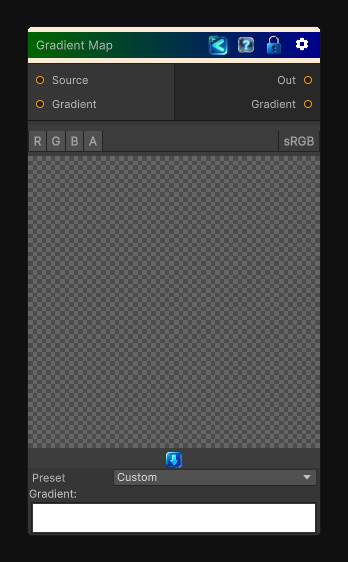

<link rel="stylesheet" href="../_assets/theme.css">

<button type="button" class="genesis-theme-toggle" data-genesis-theme-toggle aria-label="Toggle theme">Dark</button>

---
category: "Color"
---

# Gradient Map

> Remaps a grayscale input through a Unity Gradient editor and outputs the generated color gradient.

## Description

Remaps a grayscale input through a Unity Gradient editor and outputs the generated color gradient.

## Inputs

| Name | Type | Description |
|------|------|-------------|

## Outputs

| Name | Type |
|------|------|

## Parameters

| Setting | Type | Default | Description |
|---------|------|---------|-------------|
| Source | 2D | white | Grayscale source input |
| Gradient | 2D | white | Controls the gradient. |
| Preview Ramp | Float | 1.0 | Controls the preview ramp. |

## See Also

- [Back to Gradient Map](./color-index.md)
