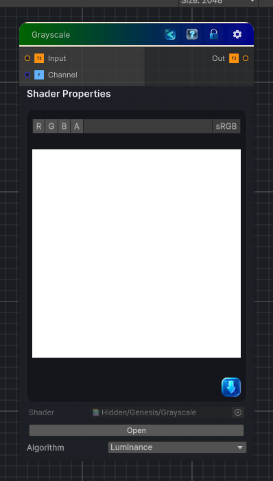

<link rel="stylesheet" href="../_assets/theme.css">

<button type="button" class="genesis-theme-toggle" data-genesis-theme-toggle aria-label="Toggle theme">Dark</button>

---
category: "Color"
---

# Grayscale

> Converts the input image to grayscale.

## Description

Converts the input image to grayscale.

Use the `Algorithm` property to choose how the grayscale value is computed:

| Name | Description |
| --- | --- |
| Luminance | Uses the perceived luminance of the color. |
| Average | Uses the average of the RGB values. |
| Min/Max | Uses the minimum or maximum RGB value. |
| Desaturation | Uses the desaturation of the color. |
| One Channel | Uses a single RGB channel selected by the `Channel` property. |
| Gamma Corrected | Uses gamma-corrected RGB values. |

## Inputs

| Name | Type | Description |
|------|------|-------------|
| Input | Texture2D |  |
| Channel | Single |  |

## Outputs

| Name | Type |
|------|------|
| Out | Texture2D |

## Parameters

| Setting | Type | Default | Description |
|---------|------|---------|-------------|
| Algorithm | int | 0 | Algorithm for converting to grayscale |
| Channel | Enum | 0 | Controls the channel. |

## See Also

- [Back to Grayscale](./color-index.md)
