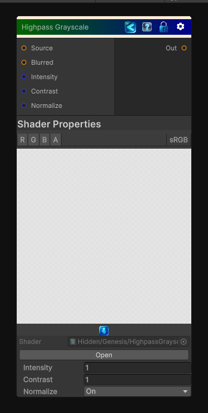

<link rel="stylesheet" href="../_assets/theme.css">

<button type="button" class="genesis-theme-toggle" data-genesis-theme-toggle aria-label="Toggle theme">Dark</button>

---
category: "Color"
---

# Highpass Grayscale

> Extracts high-frequency detail from the input by blurring it, subtracting the blurred result from the original, and remapping the difference into a grayscale result.

## Description

Extracts high-frequency detail from the input by blurring it, subtracting the blurred result from the original, and remapping the difference into a grayscale result.

Use this to build detail masks, sharpen monochrome data, or isolate fine surface variation.

## Inputs

| Name | Type | Description |
|------|------|-------------|

## Outputs

| Name | Type |
|------|------|

## Parameters

| Setting | Type | Default | Description |
|---------|------|---------|-------------|
| Source | 2D | white | Original grayscale input |
| Blurred | 2D | gray | Blurred grayscale input |
| Intensity | Float | 1.0 | Highpass intensity |
| Contrast | Float | 1.0 | Contrast shaping |
| Normalize | Enum | 1 | Normalize output 0 to 1 |

## See Also

- [Back to Highpass Grayscale](./color-index.md)
