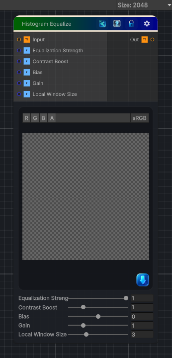

<link rel="stylesheet" href="../_assets/theme.css">

<button type="button" class="genesis-theme-toggle" data-genesis-theme-toggle aria-label="Toggle theme">Dark</button>

---
category: "Color"
---

# Histogram Equalize

> - Local histogram equalization (windowed CDF approximation)

## Description

- Local histogram equalization (windowed CDF approximation)
- Contrast boost
- Adaptive normalization
- Bias + gain shaping
- Fully deterministic
- CRT‑safe
- No texture sampling beyond the input

## Inputs

| Name | Type | Description |
|------|------|-------------|
| Input | Texture2D |  |
| Equalization Strength | Single |  |
| Contrast Boost | Single |  |
| Bias | Single |  |
| Gain | Single |  |
| Local Window Size | Single |  |

## Outputs

| Name | Type |
|------|------|
| Out | Texture2D |

## Parameters

| Setting | Type | Default | Description |
|---------|------|---------|-------------|
| Equalization Strength | Range | 1.0 | Controls the equalization strength. |
| Contrast Boost | Range | 1.0 | Controls the contrast boost. |
| Bias | Range | 0.0 | Controls the bias. |
| Gain | Range | 1.0 | Controls the gain. |
| Local Window Size | Range | 3.0 | Controls the local window size. |

## See Also

- [Back to Histogram Equalize](./color-index.md)
