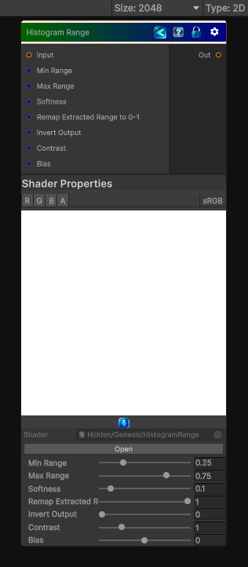

<link rel="stylesheet" href="../_assets/theme.css">

<button type="button" class="genesis-theme-toggle" data-genesis-theme-toggle aria-label="Toggle theme">Dark</button>

---
category: "Color"
---

# Histogram Range

> Reduces and repositions the value range of a grayscale input.

## Description

Reduces and repositions the value range of a grayscale input.

- Range controls the width of the output range. A value of 1 preserves the input;
  a value of 0 collapses it to a constant.
- Position places the reduced range between black and white. At 0.5 the range is centered.

Useful for compressing contrast while retaining smooth grayscale transitions.

## Inputs

| Name | Type | Description |
|------|------|-------------|
| Input | Texture2D |  |
| Range | Single | Width of the output grayscale range |
| Position | Single | Position of the reduced range between black and white |

## Outputs

| Name | Type |
|------|------|
| Out | Texture2D |

## Parameters

| Setting | Type | Default | Description |
|---------|------|---------|-------------|
| Range | Range | 1 | Width of the output grayscale range |
| Position | Range | 0.5 | Position of the reduced range between black and white |

## See Also

- [Back to Histogram Range](./color-index.md)
