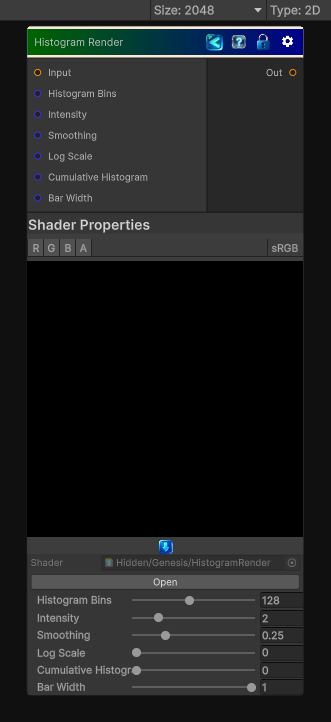

<link rel="stylesheet" href="../_assets/theme.css">

<button type="button" class="genesis-theme-toggle" data-genesis-theme-toggle aria-label="Toggle theme">Dark</button>

---
category: "Color"
---

# Histogram Render

> - Compute a histogram of the input grayscale

## Description

- Compute a histogram of the input grayscale
- Normalize it
- Render it as a bar graph
- Optional log scale
- Optional smoothing
- Optional cumulative mode
This version gives you:
- 256‑bin histogram
- Linear or log scale
- Optional smoothing
- Optional cumulative histogram
- Adjustable bar width
- Adjustable intensity
- Fully deterministic

## Inputs

| Name | Type | Description |
|------|------|-------------|

## Outputs

| Name | Type |
|------|------|

## Parameters

| Setting | Type | Default | Description |
|---------|------|---------|-------------|
| Histogram Bins | Range | 128 | Controls the histogram bins. |
| Intensity | Range | 2.0 | Controls the intensity. |
| Smoothing | Range | 0.25 | Controls the smoothing. |
| Log Scale | Range | 0 | Controls the log scale. |
| Cumulative Histogram | Range | 0 | Controls the cumulative histogram. |
| Bar Width | Range | 1.0 | Controls the bar width. |

## See Also

- [Back to Histogram Render](./color-index.md)
