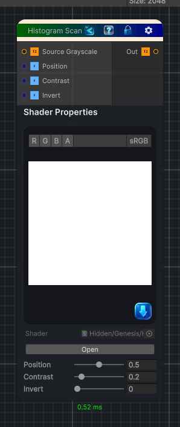

<link rel="stylesheet" href="../_assets/theme.css">

<button type="button" class="genesis-theme-toggle" data-genesis-theme-toggle aria-label="Toggle theme">Dark</button>

---
category: "Color"
---

# Histogram Scan

> Histogram Scan

## Description

Histogram Scan

## Inputs

| Name | Type | Description |
|------|------|-------------|
| Source Grayscale | Texture2D |  |
| Position | Single |  |
| Contrast | Single |  |
| Invert | Single |  |

## Outputs

| Name | Type |
|------|------|
| Out | Texture2D |

## Parameters

| Setting | Type | Default | Description |
|---------|------|---------|-------------|
| Source Grayscale | 2D | white | Controls the source grayscale. |
| Position | Range | 0.5 | Controls the position. |
| Contrast | Range | 0.2 | Controls the contrast. |
| Invert | Range | 0.0 | Controls the invert. |

## See Also

- [Back to Histogram Scan](./color-index.md)
