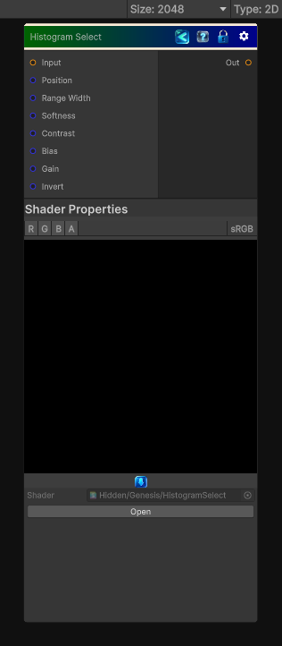

<link rel="stylesheet" href="../_assets/theme.css">

<button type="button" class="genesis-theme-toggle" data-genesis-theme-toggle aria-label="Toggle theme">Dark</button>

---
category: "Color"
---

# Histogram Select

> It’s basically a smart range selector that:

## Description

It’s basically a smart range selector that:
- Finds a value range inside the histogram
- Lets you slide that range across the histogram
- Lets you adjust width, position, and contrast
- Outputs a clean 0–1 mask
It’s like Histogram Scan + Histogram Range, but with a movable window that selects a slice of the histogram.

## Inputs

| Name | Type | Description |
|------|------|-------------|

## Outputs

| Name | Type |
|------|------|

## Parameters

| Setting | Type | Default | Description |
|---------|------|---------|-------------|
| Position | Range | 0.5 | Controls the position. |
| Range Width | Range | 0.25 | Controls the range width. |
| Softness | Range | 0.1 | Controls the softness. |
| Contrast | Range | 1.0 | Controls the contrast. |
| Bias | Range | 0.0 | Controls the bias. |
| Gain | Range | 1.0 | Controls the gain. |
| Invert | Range | 0 | Controls the invert. |

## See Also

- [Back to Histogram Select](./color-index.md)
