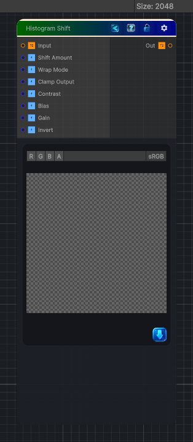

<link rel="stylesheet" href="../_assets/theme.css">

<button type="button" class="genesis-theme-toggle" data-genesis-theme-toggle aria-label="Toggle theme">Dark</button>

---
category: "Color"
---

# Histogram Shift

> It doesn’t extract a range or scan a threshold — instead, it shifts the entire histogram left or right, optionally wrapping or clamping, and optionally applying contrast shaping.

## Description

It doesn’t extract a range or scan a threshold — instead, it shifts the entire histogram left or right, optionally wrapping or clamping, and optionally applying contrast shaping.
It’s basically:
\mathrm{out}=\mathrm{saturate}(h+\mathrm{shift})
with optional:
- Wrap mode
- Clamp mode
- Contrast shaping
- Bias/Gain shaping

## Inputs

| Name | Type | Description |
|------|------|-------------|
| Input | Texture2D |  |
| Shift Amount | Single |  |
| Wrap Mode | Single |  |
| Clamp Output | Single |  |
| Contrast | Single |  |
| Bias | Single |  |
| Gain | Single |  |
| Invert | Single |  |

## Outputs

| Name | Type |
|------|------|
| Out | Texture2D |

## Parameters

| Setting | Type | Default | Description |
|---------|------|---------|-------------|
| Shift Amount | Range | 0.0 | Controls the shift amount. |
| Wrap Mode | Range | 0 | Controls the wrap mode. |
| Clamp Output | Range | 1 | Controls the clamp output. |
| Contrast | Range | 1.0 | Controls the contrast. |
| Bias | Range | 0.0 | Controls the bias. |
| Gain | Range | 1.0 | Controls the gain. |
| Invert | Range | 0 | Controls the invert. |

## See Also

- [Back to Histogram Shift](./color-index.md)
