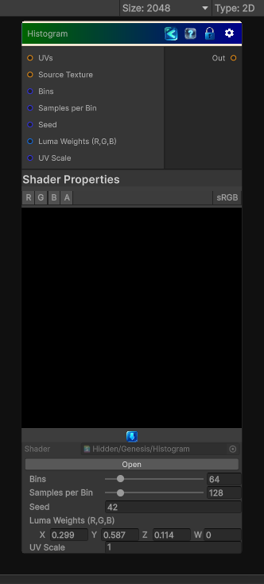

<link rel="stylesheet" href="../_assets/theme.css">

<button type="button" class="genesis-theme-toggle" data-genesis-theme-toggle aria-label="Toggle theme">Dark</button>

---
category: "Color"
---

# Histogram

> Builds a histogram from the input texture so you can inspect value distribution and drive tonal range analysis.

## Description

Builds a histogram from the input texture so you can inspect value distribution and drive tonal range analysis.

## Inputs

| Name | Type | Description |
|------|------|-------------|

## Outputs

| Name | Type |
|------|------|

## Parameters

| Setting | Type | Default | Description |
|---------|------|---------|-------------|
| Source Texture | 2D | white | Controls the source texture. |
| Bins | Int Range | 64 | Controls the bins. |
| Samples per Bin | Int Range | 128 | Controls the samples per bin. |
| Seed | Int | 42 | Controls the seed. |
| Luma Weights (R,G,B) | Vector | (0.299,0.587,0.114,0) | Controls the luma weights (r,g,b). |
| UV Scale | Float | 1.0 | Controls the uv scale. |

## See Also

- [Back to Histogram](./color-index.md)
