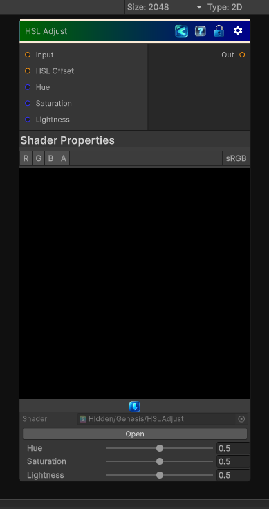

<link rel="stylesheet" href="../_assets/theme.css">

<button type="button" class="genesis-theme-toggle" data-genesis-theme-toggle aria-label="Toggle theme">Dark</button>

---
category: "Color"
---

# HSL Adjust

> Adjusts the Hue, Saturation, and Lightness of the input image (HSL color space).

## Description

Adjusts the Hue, Saturation, and Lightness of the input image (HSL color space).

All parameters use the Substance-style 0–1 range where 0.5 is neutral:
• Hue        — values < 0.5 shift hue negatively; values > 0.5 shift positively
• Saturation — values < 0.5 decrease saturation; values > 0.5 increase it
• Lightness  — values < 0.5 darken the image; values > 0.5 lighten it

An optional per-pixel HSL Offset texture is added on top of the scalar values.

## Inputs

| Name | Type | Description |
|------|------|-------------|

## Outputs

| Name | Type |
|------|------|

## Parameters

| Setting | Type | Default | Description |
|---------|------|---------|-------------|
| Hue | Range | 0.5 | Controls the hue. |
| Saturation | Range | 0.5 | Controls the saturation. |
| Lightness | Range | 0.5 | Controls the lightness. |

## See Also

- [Back to HSL Adjust](./color-index.md)
