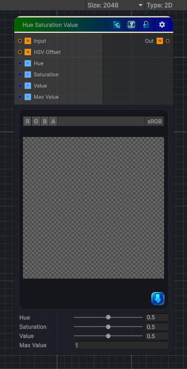

<link rel="stylesheet" href="../_assets/theme.css">

<button type="button" class="genesis-theme-toggle" data-genesis-theme-toggle aria-label="Toggle theme">Dark</button>

---
category: "Color"
---

# Hue Saturation Value

> Modify the image in the HSV color space.

## Description

Modify the image in the HSV color space.

## Inputs

| Name | Type | Description |
|------|------|-------------|
| Input | Texture2D |  |
| HSV Offset | Texture2D |  |
| Hue | Single |  |
| Saturation | Single |  |
| Value | Single |  |
| Max Value | Single | For HDR images, you need to specify the maximum value of your image |

## Outputs

| Name | Type |
|------|------|
| Out | Texture2D |

## Parameters

| Setting | Type | Default | Description |
|---------|------|---------|-------------|
| Hue | Range | 0.5 | Controls the hue. |
| Saturation | Range | 0.5 | Controls the saturation. |
| Value | Range | 0.5 | Controls the value. |
| Max Value | Float | 1.0 | For HDR images, you need to specify the maximum value of your image |

## See Also

- [Back to Hue Saturation Value](./color-index.md)
