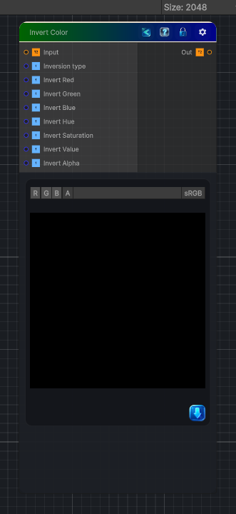

<link rel="stylesheet" href="../_assets/theme.css">

<button type="button" class="genesis-theme-toggle" data-genesis-theme-toggle aria-label="Toggle theme">Dark</button>

---
category: "Color"
---

# Invert

> Inverts colors of input (Optionally inverts alpha as well

## Description

Inverts colors of input (Optionally inverts alpha as well

## Inputs

| Name | Type | Description |
|------|------|-------------|
| Input | Texture2D |  |
| Inversion type | Single | Invertion type, either RGB or HSV |
| Invert Red | Single | Invert red channel |
| Invert Green | Single | Invert green channel |
| Invert Blue | Single | Invert blue channel |
| Invert Hue | Single | Invert hue channel |
| Invert Saturation | Single | Invert saturation channel |
| Invert Value | Single | Invert value channel |
| Invert Alpha | Single | Invert alpha channel |

## Outputs

| Name | Type |
|------|------|
| Out | Texture2D |

## Parameters

| Setting | Type | Default | Description |
|---------|------|---------|-------------|
| Inversion type | Enum | 0 | Invertion type, either RGB or HSV |
| Invert Red | Enum | 1 | Invert red channel |
| Invert Green | Enum | 1 | Invert green channel |
| Invert Blue | Enum | 1 | Invert blue channel |
| Invert Hue | Enum | 1 | Invert hue channel |
| Invert Saturation | Enum | 1 | Invert saturation channel |
| Invert Value | Enum | 1 | Invert value channel |
| Invert Alpha | Enum | 0 | Invert alpha channel |

## See Also

- [Back to Invert](./color-index.md)
