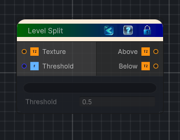

<link rel="stylesheet" href="../_assets/theme.css">

<button type="button" class="genesis-theme-toggle" data-genesis-theme-toggle aria-label="Toggle theme">Dark</button>

---
category: "Color"
---

# Level Split

> Splits a texture into two based on a luminance threshold.

## Description

Splits a texture into two based on a luminance threshold.
Above: pixels with luminance >= threshold
Below: pixels with luminance < threshold

## Inputs

| Name | Type | Description |
|------|------|-------------|
| Threshold | Single |  |
| Texture | Texture2D |  |

## Outputs

| Name | Type |
|------|------|
| Below | Texture2D |
| Above | Texture2D |

## Parameters

| Setting | Type | Default | Description |
|---------|------|---------|-------------|
| nodeVariables | VariableStorage | AhahGames.GenesisNoise.Graph.VariableStorage | |
| GUID | String | 30c6479d-4845-4d1f-90d6-ed068891633a | |
| expanded | Boolean | False | |

## See Also

- [Back to Level Split](./color-index.md)
