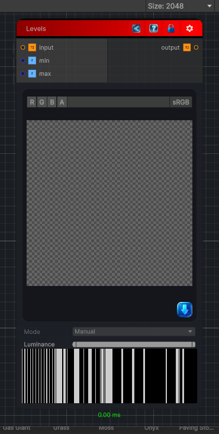

<link rel="stylesheet" href="../_assets/theme.css">

<button type="button" class="genesis-theme-toggle" data-genesis-theme-toggle aria-label="Toggle theme">Dark</button>

---
category: "Color"
---

# Levels

> Adjusts black point, white point, gamma, and output range for the input.

## Description

Adjusts black point, white point, gamma, and output range for the input.

## Inputs

| Name | Type | Description |
|------|------|-------------|
| max | Single |  |
| min | Single |  |
| input | Texture2D |  |

## Outputs

| Name | Type |
|------|------|
| output | Texture2D |

## Parameters

| Setting | Type | Default | Description |
|---------|------|---------|-------------|
| mode | Mode | Manual | |
| channelMode | ChannelMode | Single | |
| interpolationCurve | AnimationCurve | UnityEngine.AnimationCurve | |
| interpolationCurveR | AnimationCurve | UnityEngine.AnimationCurve | |
| interpolationCurveG | AnimationCurve | UnityEngine.AnimationCurve | |
| interpolationCurveB | AnimationCurve | UnityEngine.AnimationCurve | |
| nodeVariables | VariableStorage | AhahGames.GenesisNoise.Graph.VariableStorage | |
| GUID | String | d59558e4-69ec-4cb8-b4bd-6a11dfffa790 | |
| expanded | Boolean | False | |

## See Also

- [Back to Levels](./color-index.md)
