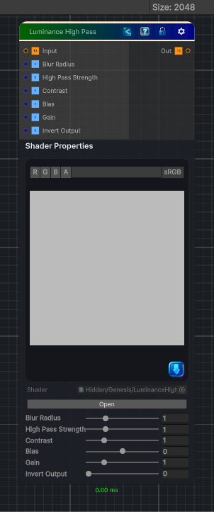

<link rel="stylesheet" href="../_assets/theme.css">

<button type="button" class="genesis-theme-toggle" data-genesis-theme-toggle aria-label="Toggle theme">Dark</button>

---
category: "Color"
---

# Luminance High Pass

> Luminance High Pass does this:

## Description

 Luminance High Pass does this:
- Convert input to luminance
- Blur luminance (usually a small radius)
- Subtract blurred luminance from original luminance
- Normalize and clamp
- Optional contrast shaping

## Inputs

| Name | Type | Description |
|------|------|-------------|
| Input | Texture2D |  |
| Blur Radius | Single |  |
| High Pass Strength | Single |  |
| Contrast | Single |  |
| Bias | Single |  |
| Gain | Single |  |
| Invert Output | Single |  |

## Outputs

| Name | Type |
|------|------|
| Out | Texture2D |

## Parameters

| Setting | Type | Default | Description |
|---------|------|---------|-------------|
| Blur Radius | Range | 1.0 | Controls the blur radius. |
| High Pass Strength | Range | 1.0 | Controls the high pass strength. |
| Contrast | Range | 1.0 | Controls the contrast. |
| Bias | Range | 0.0 | Controls the bias. |
| Gain | Range | 1.0 | Controls the gain. |
| Invert Output | Range | 0 | Controls the invert output. |

## See Also

- [Back to Luminance High Pass](./color-index.md)
