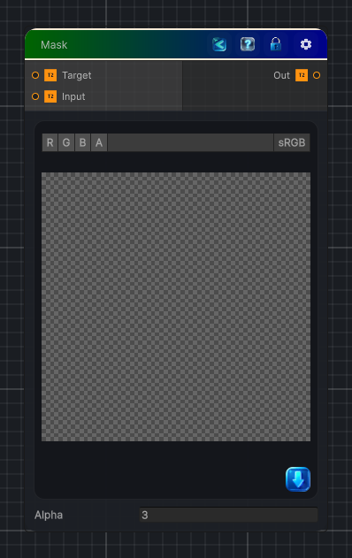

<link rel="stylesheet" href="../_assets/theme.css">

<button type="button" class="genesis-theme-toggle" data-genesis-theme-toggle aria-label="Toggle theme">Dark</button>

---
category: "Color"
---

# Mask

> Sample the target texture and mask it using input texture. Note that the mask is written in the alpha channel of the output.

## Description

Sample the target texture and mask it using input texture. Note that the mask is written in the alpha channel of the output.

## Inputs

| Name | Type | Description |
|------|------|-------------|
| Target | Texture2D |  |
| Input | Texture2D |  |

## Outputs

| Name | Type |
|------|------|
| Out | Texture2D |

## Parameters

| Setting | Type | Default | Description |
|---------|------|---------|-------------|
| Alpha | Float | 3 | Controls the alpha. |

## See Also

- [Back to Mask](./color-index.md)
