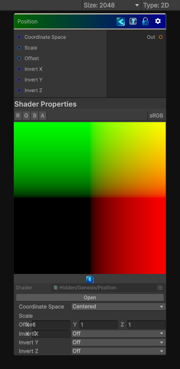

<link rel="stylesheet" href="../_assets/theme.css">

<button type="button" class="genesis-theme-toggle" data-genesis-theme-toggle aria-label="Toggle theme">Dark</button>

---
category: "Color"
---

# Position

> Generates a Substance-style position map from the current texture coordinates, with X, Y, and Z encoded in RGB.

## Description

Generates a Substance-style position map from the current texture coordinates, with X, Y, and Z encoded in RGB.

## Inputs

| Name | Type | Description |
|------|------|-------------|

## Outputs

| Name | Type |
|------|------|

## Parameters

| Setting | Type | Default | Description |
|---------|------|---------|-------------|
| Coordinate Space | Enum | 1 | Output normalized coordinates or centered coordinates |
| Scale | Vector | (1.0,1.0,1.0,0.0) | Controls the scale. |
| Offset | Vector | (0.0,0.0,0.0,0.0) | Controls the offset. |
| Invert X | Enum | 0 | Invert the X channel |
| Invert Y | Enum | 0 | Invert the Y channel |
| Invert Z | Enum | 0 | Invert the Z channel |

## See Also

- [Back to Position](./color-index.md)
