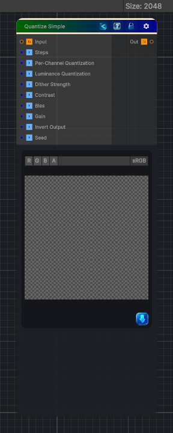

<link rel="stylesheet" href="../_assets/theme.css">

<button type="button" class="genesis-theme-toggle" data-genesis-theme-toggle aria-label="Toggle theme">Dark</button>

---
category: "Color"
---

# Quantize Simple

> Quantize Color (Simple) is one of the most useful for stylization, posterization, toon shading, palette reduction, and mask creation. The Substance version does exactly this:

## Description

Quantize Color (Simple) is one of the most useful for stylization, posterization, toon shading, palette reduction, and mask creation. The Substance version does exactly this:
- Take an RGB input
- Convert to luminance or operate per‑channel
- Quantize into N discrete steps
- Optionally remap back to 0–1
- Output the quantized color
The “Simple” version in Substance is literally:
\mathrm{quantized}=\frac{\mathrm{round}(v\cdot N)}{N}
Where N is the number of steps.

## Inputs

| Name | Type | Description |
|------|------|-------------|
| Input | Texture2D |  |
| Steps | Single |  |
| Per-Channel Quantization | Single |  |
| Luminance Quantization | Single |  |
| Dither Strength | Single |  |
| Contrast | Single |  |
| Bias | Single |  |
| Gain | Single |  |
| Invert Output | Single |  |
| Seed | Single |  |

## Outputs

| Name | Type |
|------|------|
| Out | Texture2D |

## Parameters

| Setting | Type | Default | Description |
|---------|------|---------|-------------|
| Steps | Range | 8 | Controls the steps. |
| Per-Channel Quantization | Range | 1 | Controls the per-channel quantization. |
| Luminance Quantization | Range | 0 | Controls the luminance quantization. |
| Dither Strength | Range | 0.0 | Controls the dither strength. |
| Contrast | Range | 1.0 | Controls the contrast. |
| Bias | Range | 0.0 | Controls the bias. |
| Gain | Range | 1.0 | Controls the gain. |
| Invert Output | Range | 0 | Controls the invert output. |
| Seed | Float | 1 | Controls the seed. |

## See Also

- [Back to Quantize Simple](./color-index.md)
