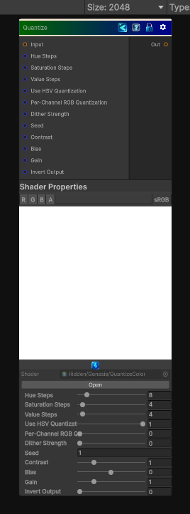

<link rel="stylesheet" href="../_assets/theme.css">

<button type="button" class="genesis-theme-toggle" data-genesis-theme-toggle aria-label="Toggle theme">Dark</button>

---
category: "Color"
---

# Quantize

> Quantize Color Simple is the lightweight posterizer, but Quantize Color  is a more advanced, perceptually‑aware quantizer. It doesn’t just round channels — it quantizes in color space, usually HSV or HSL, and gives artists control over:

## Description

 Quantize Color Simple is the lightweight posterizer, but Quantize Color  is a more advanced, perceptually‑aware quantizer. It doesn’t just round channels — it quantizes in color space, usually HSV or HSL, and gives artists control over:
- Hue steps
- Saturation steps
- Value steps
- Quantization mode (per‑channel, HSV, HSL)
- Dithering
- Preserving luminance
- Preserving saturation

## Inputs

| Name | Type | Description |
|------|------|-------------|
| Input | Texture2D |  |
| Hue Steps | Single |  |
| Saturation Steps | Single |  |
| Value Steps | Single |  |
| Use HSV Quantization | Single |  |
| Per-Channel RGB Quantization | Single |  |
| Dither Strength | Single |  |
| Seed | Single |  |
| Contrast | Single |  |
| Bias | Single |  |
| Gain | Single |  |
| Invert Output | Single |  |

## Outputs

| Name | Type |
|------|------|
| Out | Texture2D |

## Parameters

| Setting | Type | Default | Description |
|---------|------|---------|-------------|
| Hue Steps | Range | 8 | Controls the hue steps. |
| Saturation Steps | Range | 4 | Controls the saturation steps. |
| Value Steps | Range | 4 | Controls the value steps. |
| Use HSV Quantization | Range | 1 | Controls the use hsv quantization. |
| Per-Channel RGB Quantization | Range | 0 | Controls the per-channel rgb quantization. |
| Dither Strength | Range | 0.0 | Controls the dither strength. |
| Seed | Float | 1 | Controls the seed. |
| Contrast | Range | 1.0 | Controls the contrast. |
| Bias | Range | 0.0 | Controls the bias. |
| Gain | Range | 1.0 | Controls the gain. |
| Invert Output | Range | 0 | Controls the invert output. |

## See Also

- [Back to Quantize](./color-index.md)
