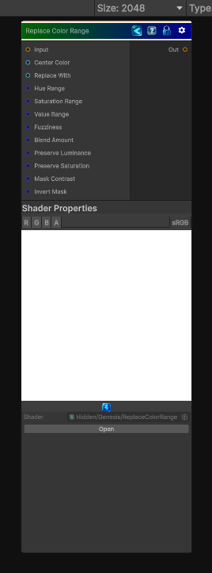

<link rel="stylesheet" href="../_assets/theme.css">

<button type="button" class="genesis-theme-toggle" data-genesis-theme-toggle aria-label="Toggle theme">Dark</button>

---
category: "Color"
---

# Replace Color Range

> Replace Color Range is the natural evolution of Replace Color — instead of targeting a single color, you target a band of colors defined by:

## Description

Replace Color Range is the natural evolution of Replace Color — instead of targeting a single color, you target a band of colors defined by:
- A center color
- A hue range
- A saturation range
- A value (luminance) range
- A fuzziness falloff
- A replacement color
- A blend amount
Think of it as Histogram Select + Replace Color, but in HSV space.
This is extremely useful for stylized workflows:
- Replace all warm hues with cool hues
- Replace all greens with a stylized palette
- Replace all dark reds with bright oranges
- Replace all desaturated colors with a new tone

## Inputs

| Name | Type | Description |
|------|------|-------------|

## Outputs

| Name | Type |
|------|------|

## Parameters

| Setting | Type | Default | Description |
|---------|------|---------|-------------|
| Center Color | Color | (1,0,0,1) | Controls the center color. |
| Replace With | Color | (0,1,0,1) | Controls the replace with. |
| Hue Range | Range | 0.15 | Controls the hue range. |
| Saturation Range | Range | 0.25 | Controls the saturation range. |
| Value Range | Range | 0.25 | Controls the value range. |
| Fuzziness | Range | 0.25 | Controls the fuzziness. |
| Blend Amount | Range | 1.0 | Controls the blend amount. |
| Preserve Luminance | Range | 0 | Controls the preserve luminance. |
| Preserve Saturation | Range | 0 | Controls the preserve saturation. |
| Mask Contrast | Range | 1.0 | Controls the mask contrast. |
| Invert Mask | Range | 0 | Controls the invert mask. |

## See Also

- [Back to Replace Color Range](./color-index.md)
