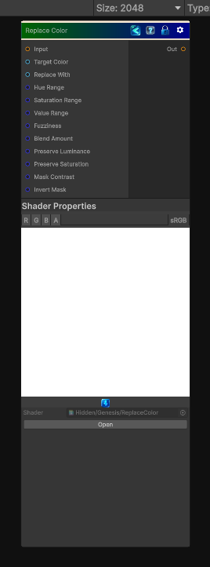

<link rel="stylesheet" href="../_assets/theme.css">

<button type="button" class="genesis-theme-toggle" data-genesis-theme-toggle aria-label="Toggle theme">Dark</button>

---
category: "Color"
---

# Replace Color

> - Selects a target color

## Description

- Selects a target color
- Computes distance in color space (usually HSV or HSL)
- Applies a falloff (threshold + fuzziness)
- Replaces the selected region with a new color
- Optionally blends between original and replaced color
- Supports hue‑only, saturation‑only, or full‑color replacement

## Inputs

| Name | Type | Description |
|------|------|-------------|

## Outputs

| Name | Type |
|------|------|

## Parameters

| Setting | Type | Default | Description |
|---------|------|---------|-------------|
| Target Color | Color | (1,0,0,1) | Controls the target color. |
| Replace With | Color | (0,1,0,1) | Controls the replace with. |
| Hue Range | Range | 0.1 | Controls the hue range. |
| Saturation Range | Range | 0.2 | Controls the saturation range. |
| Value Range | Range | 0.2 | Controls the value range. |
| Fuzziness | Range | 0.25 | Controls the fuzziness. |
| Blend Amount | Range | 1.0 | Controls the blend amount. |
| Preserve Luminance | Range | 0 | Controls the preserve luminance. |
| Preserve Saturation | Range | 0 | Controls the preserve saturation. |
| Mask Contrast | Range | 1.0 | Controls the mask contrast. |
| Invert Mask | Range | 0 | Controls the invert mask. |

## See Also

- [Back to Replace Color](./color-index.md)
