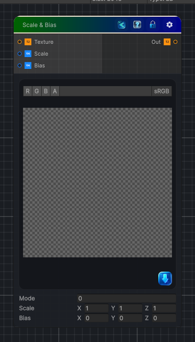

<link rel="stylesheet" href="../_assets/theme.css">

<button type="button" class="genesis-theme-toggle" data-genesis-theme-toggle aria-label="Toggle theme">Dark</button>

---
category: "Color"
---

# Scale & Bias

> Apply a Scale and Bias on the input texture color.

## Description

Apply a Scale and Bias on the input texture color.

## Inputs

| Name | Type | Description |
|------|------|-------------|
| Texture | Texture2D |  |
| Scale | Vector4 |  |
| Bias | Vector4 |  |

## Outputs

| Name | Type |
|------|------|
| Out | Texture2D |

## Parameters

| Setting | Type | Default | Description |
|---------|------|---------|-------------|
| Mode | Float | 0 | Controls the mode. |
| Scale | Vector | (1.0,1.0,1.0,0.0) | Controls the scale. |
| Bias | Vector | (0.0,0.0,0.0,0.0) | Controls the bias. |

## See Also

- [Back to Scale & Bias](./color-index.md)
