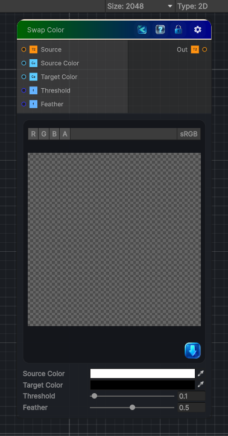

<link rel="stylesheet" href="../_assets/theme.css">

<button type="button" class="genesis-theme-toggle" data-genesis-theme-toggle aria-label="Toggle theme">Dark</button>

---
category: "Color"
---

# Swap Color

> Replace the source color by the target color in the image.

## Description

Replace the source color by the target color in the image.

## Inputs

| Name | Type | Description |
|------|------|-------------|
| Source | Texture2D |  |
| Source Color | Color | Color to replace in the image |
| Target Color | Color | Color that replaces the source color. |
| Threshold | Single | Tolerance of the test to replace the colors. |
| Feather | Single | How sharp the transition between colors are. |

## Outputs

| Name | Type |
|------|------|
| Out | Texture2D |

## Parameters

| Setting | Type | Default | Description |
|---------|------|---------|-------------|
| Source Color | Color | (1, 1, 1, 1) | Color to replace in the image |
| Target Color | Color | (0, 0, 0, 0) | Color that replaces the source color. |
| Threshold | Range | 0.1 | Tolerance of the test to replace the colors. |
| Feather | Range | 0.5 | How sharp the transition between colors are. |
| Color Mode | Enum | 0 | Select which color component the comparison will use |

## See Also

- [Back to Swap Color](./color-index.md)
