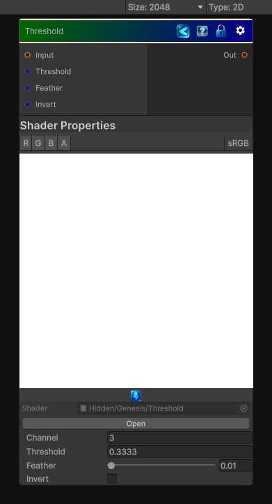

<link rel="stylesheet" href="../_assets/theme.css">

<button type="button" class="genesis-theme-toggle" data-genesis-theme-toggle aria-label="Toggle theme">Dark</button>

---
category: "Color"
---

# Threshold

> Apply a threshold value to a channel of the input texture and output the result. You can use the Feather parameter to smooth the step.

## Description

Apply a threshold value to a channel of the input texture and output the result. You can use the Feather parameter to smooth the step.

## Inputs

| Name | Type | Description |
|------|------|-------------|

## Outputs

| Name | Type |
|------|------|

## Parameters

| Setting | Type | Default | Description |
|---------|------|---------|-------------|
| Channel | Float | 3 | Controls the channel. |
| Threshold | Float | 0.3333 | Controls the threshold. |
| Feather | Range | 0.01 | Smooth the treshold step |
| Invert | Float | 0.0 | Controls the invert. |

## See Also

- [Back to Threshold](./color-index.md)
