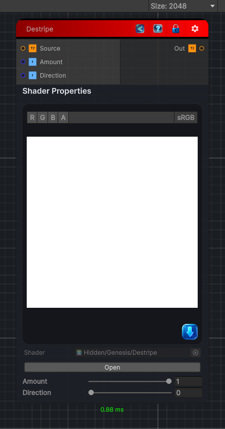

<link rel="stylesheet" href="../_assets/theme.css">

<button type="button" class="genesis-theme-toggle" data-genesis-theme-toggle aria-label="Toggle theme">Dark</button>

---
category: "Color/Tone Mapping"
---

# Destripe

> Destripe, like GIMP. Removes regular horizontal (or vertical) stripes by taking a 9-tap median along the stripe-normal direction and rescaling the pixel's luminance toward that median, so periodic banding is suppressed while detail is kept. Amount is the blend toward the median, Direction selects which stripe orientation to remove (0 = horizontal stripes, 1 = vertical).

## Description

Destripe, like GIMP. Removes regular horizontal (or vertical) stripes by taking a 9-tap median along the stripe-normal direction and rescaling the pixel's luminance toward that median, so periodic banding is suppressed while detail is kept. Amount is the blend toward the median, Direction selects which stripe orientation to remove (0 = horizontal stripes, 1 = vertical).

## Inputs

| Name | Type | Description |
|------|------|-------------|

## Outputs

| Name | Type |
|------|------|

## Parameters

| Setting | Type | Default | Description |
|---------|------|---------|-------------|
| Amount | Range | 1 | Controls the amount. |
| Direction | Range | 0 | Controls the direction. |

## See Also

- [Back to Destripe](./color-index.md)
