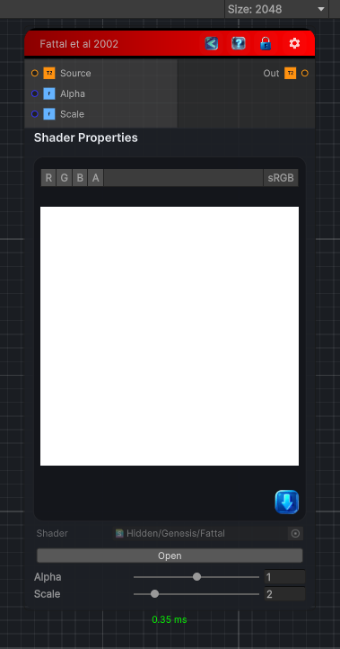

<link rel="stylesheet" href="../_assets/theme.css">

<button type="button" class="genesis-theme-toggle" data-genesis-theme-toggle aria-label="Toggle theme">Dark</button>

---
category: "Color/Tone Mapping"
---

# Fattal et al 2002

> Fattal et al 2002 tone mapping, like GIMP. A single-pass approximation of the gradient-domain HDR compression: it measures the local luminance gradient, attenuates the large (illumination) gradients while keeping fine detail, and rescales the image so dynamic range is reduced without flattening texture. Alpha is the attenuation strength, Scale the gradient sample size.

## Description

Fattal et al 2002 tone mapping, like GIMP. A single-pass approximation of the gradient-domain HDR compression: it measures the local luminance gradient, attenuates the large (illumination) gradients while keeping fine detail, and rescales the image so dynamic range is reduced without flattening texture. Alpha is the attenuation strength, Scale the gradient sample size.

## Inputs

| Name | Type | Description |
|------|------|-------------|

## Outputs

| Name | Type |
|------|------|

## Parameters

| Setting | Type | Default | Description |
|---------|------|---------|-------------|
| Alpha | Range | 1 | Controls the alpha. |
| Scale | Range | 2 | Controls the scale. |

## See Also

- [Back to Fattal et al 2002](./color-index.md)
