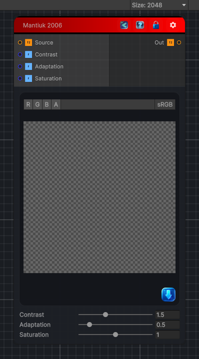

<link rel="stylesheet" href="../_assets/theme.css">

<button type="button" class="genesis-theme-toggle" data-genesis-theme-toggle aria-label="Toggle theme">Dark</button>

---
category: "Color/Tone Mapping"
---

# Mantiuk 2006

> Mantiuk 2006 tone mapping, like GIMP. A single-pass approximation of the perceptual contrast-based mapper: luminance is run through a Naka-Rushton sigmoid in power space, giving an S-curve that compresses extremes while keeping mid-tone contrast. Contrast sets the curve steepness, Adaptation the midpoint, and Saturation the post-mapping colour saturation.

## Description

Mantiuk 2006 tone mapping, like GIMP. A single-pass approximation of the perceptual contrast-based mapper: luminance is run through a Naka-Rushton sigmoid in power space, giving an S-curve that compresses extremes while keeping mid-tone contrast. Contrast sets the curve steepness, Adaptation the midpoint, and Saturation the post-mapping colour saturation.

## Inputs

| Name | Type | Description |
|------|------|-------------|
| Source | Texture2D |  |
| Contrast | Single |  |
| Adaptation | Single |  |
| Saturation | Single |  |

## Outputs

| Name | Type |
|------|------|
| Out | Texture2D |

## Parameters

| Setting | Type | Default | Description |
|---------|------|---------|-------------|
| Contrast | Range | 1.5 | Controls the contrast. |
| Adaptation | Range | 0.5 | Controls the adaptation. |
| Saturation | Range | 1 | Controls the saturation. |

## See Also

- [Back to Mantiuk 2006](./color-index.md)
