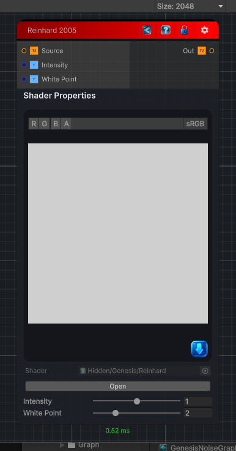

<link rel="stylesheet" href="../_assets/theme.css">

<button type="button" class="genesis-theme-toggle" data-genesis-theme-toggle aria-label="Toggle theme">Dark</button>

---
category: "Color/Tone Mapping"
---

# Reinhard 2005

> Reinhard 2005 tone mapping, like GIMP. The global Reinhard operator with a white point: luminance is scaled by Intensity and mapped with L*(1 + L/Lw2)/(1 + L), then colour is rescaled by the luminance ratio. Intensity is the key/exposure and White Point the upper white luminance.

## Description

Reinhard 2005 tone mapping, like GIMP. The global Reinhard operator with a white point: luminance is scaled by Intensity and mapped with L*(1 + L/Lw2)/(1 + L), then colour is rescaled by the luminance ratio. Intensity is the key/exposure and White Point the upper white luminance.

## Inputs

| Name | Type | Description |
|------|------|-------------|

## Outputs

| Name | Type |
|------|------|

## Parameters

| Setting | Type | Default | Description |
|---------|------|---------|-------------|
| Intensity | Range | 1 | Controls the intensity. |
| White Point | Range | 2 | Controls the white point. |

## See Also

- [Back to Reinhard 2005](./color-index.md)
