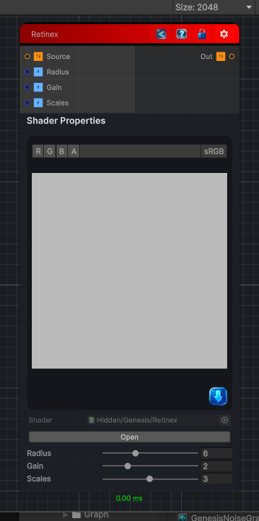

<link rel="stylesheet" href="../_assets/theme.css">

<button type="button" class="genesis-theme-toggle" data-genesis-theme-toggle aria-label="Toggle theme">Dark</button>

---
category: "Color/Tone Mapping"
---

# Retinex

> Retinex, like GIMP (multi-scale retinex). Computes log(input) - log(blurred input) at several scales and averages them to recover reflectance, cancelling illumination. Radius is the base blur size, Scales the number of blur scales, and Gain the display gain. Output is the retinex (reflectance) image.

## Description

Retinex, like GIMP (multi-scale retinex). Computes log(input) - log(blurred input) at several scales and averages them to recover reflectance, cancelling illumination. Radius is the base blur size, Scales the number of blur scales, and Gain the display gain. Output is the retinex (reflectance) image.

## Inputs

| Name | Type | Description |
|------|------|-------------|

## Outputs

| Name | Type |
|------|------|

## Parameters

| Setting | Type | Default | Description |
|---------|------|---------|-------------|
| Radius | Range | 6 | Controls the radius. |
| Gain | Range | 2 | Controls the gain. |
| Scales | Range | 3 | Controls the scales. |

## See Also

- [Back to Retinex](./color-index.md)
