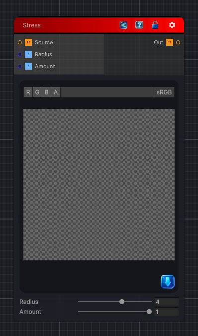

<link rel="stylesheet" href="../_assets/theme.css">

<button type="button" class="genesis-theme-toggle" data-genesis-theme-toggle aria-label="Toggle theme">Dark</button>

---
category: "Color/Tone Mapping"
---

# Stress

> Stress tone mapping, like GIMP. Local adaptive contrast stretch: for each pixel the minimum and maximum luminance over a Radius disk are found, and the pixel is stretched between them, enhancing local detail. Radius sets the neighbourhood size and Amount how much of the stretch is applied.

## Description

Stress tone mapping, like GIMP. Local adaptive contrast stretch: for each pixel the minimum and maximum luminance over a Radius disk are found, and the pixel is stretched between them, enhancing local detail. Radius sets the neighbourhood size and Amount how much of the stretch is applied.

## Inputs

| Name | Type | Description |
|------|------|-------------|
| Source | Texture2D |  |
| Radius | Single |  |
| Amount | Single |  |

## Outputs

| Name | Type |
|------|------|
| Out | Texture2D |

## Parameters

| Setting | Type | Default | Description |
|---------|------|---------|-------------|
| Radius | Range | 4 | Controls the radius. |
| Amount | Range | 1 | Controls the amount. |

## See Also

- [Back to Stress](./color-index.md)
