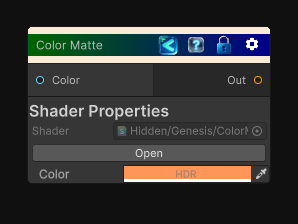

<link rel="stylesheet" href="../_assets/theme.css">

<button type="button" class="genesis-theme-toggle" data-genesis-theme-toggle aria-label="Toggle theme">Dark</button>

---
category: "Color"
---

# Uniform Color

> Generate a texture from an HDR color.

## Description

Generate a texture from an HDR color.

## Inputs

| Name | Type | Description |
|------|------|-------------|

## Outputs

| Name | Type |
|------|------|

## Parameters

| Setting | Type | Default | Description |
|---------|------|---------|-------------|
| Color | Color | (1.0,0.3,0.1,1.0) | Controls the color. |

## See Also

- [Back to Uniform Color](./color-index.md)
