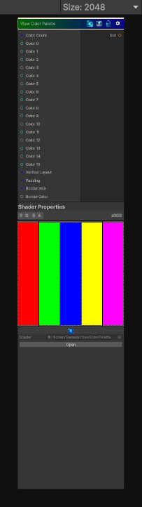

<link rel="stylesheet" href="../_assets/theme.css">

<button type="button" class="genesis-theme-toggle" data-genesis-theme-toggle aria-label="Toggle theme">Dark</button>

---
category: "Color"
---

# View Color Palette

> - Displays 2–16 palette colors

## Description

- Displays 2–16 palette colors
- Supports horizontal or vertical layout
- Supports padding
- Supports border thickness + color
- Supports per‑swatch labels (optional grayscale stripes)

## Inputs

| Name | Type | Description |
|------|------|-------------|

## Outputs

| Name | Type |
|------|------|

## Parameters

| Setting | Type | Default | Description |
|---------|------|---------|-------------|
| Color Count | Range | 5 | Controls the color count. |
| Color 0 | Color | (1,0,0,1) | Controls the color 0. |
| Color 1 | Color | (0,1,0,1) | Controls the color 1. |
| Color 2 | Color | (0,0,1,1) | Controls the color 2. |
| Color 3 | Color | (1,1,0,1) | Controls the color 3. |
| Color 4 | Color | (1,0,1,1) | Controls the color 4. |
| Color 5 | Color | (0,1,1,1) | Controls the color 5. |
| Color 6 | Color | (0.5,0.5,0.5,1) | Controls the color 6. |
| Color 7 | Color | (1,0.5,0,1) | Controls the color 7. |
| Color 8 | Color | (0.2,0.8,0.4,1) | Controls the color 8. |
| Color 9 | Color | (0.8,0.2,0.4,1) | Controls the color 9. |
| Color 10 | Color | (0.3,0.3,0.9,1) | Controls the color 10. |
| Color 11 | Color | (0.9,0.3,0.3,1) | Controls the color 11. |
| Color 12 | Color | (0.3,0.9,0.3,1) | Controls the color 12. |
| Color 13 | Color | (0.9,0.9,0.3,1) | Controls the color 13. |
| Color 14 | Color | (0.3,0.9,0.9,1) | Controls the color 14. |
| Color 15 | Color | (0.9,0.3,0.9,1) | Controls the color 15. |
| Vertical Layout | Range | 0 | Controls the vertical layout. |
| Padding | Range | 0.02 | Controls the padding. |
| Border Size | Range | 0.005 | Controls the border size. |
| Border Color | Color | (0,0,0,1) | Controls the border color. |

## See Also

- [Back to View Color Palette](./color-index.md)
